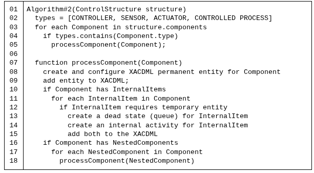
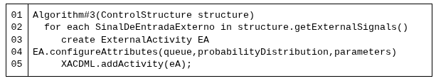
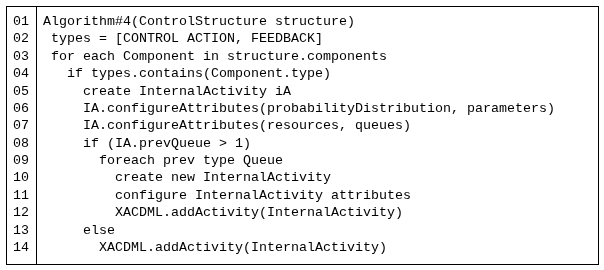

# Algoritmos de Mapeamento da Estrutura de Controle STPA para Modelos ACD em XACDML 

Este repositório apresenta os resultados do Trabalho de Conclusão de Curso intitulado:
“Algoritmos de Mapeamento da Estrutura de Controle STPA para Modelos ACD em XACDML”.

O objetivo do projeto é utilizar 5 algoritmos para mapear a estrutura de controle derivada nos Passos 1 e 2 do STPA em modelos ACD descritos em XACDML, permitindo a geração automatizada de um simulador em Java via XSLT.

Esse processo cria uma ponte entre a análise STPA e a execução do modelo de simulação que representa o sistema, possibilitando validar o comportamento dos componentes, suas interações e a quantidade de entidades que trafegam pelo sistema.

## Visão Geral

Neste repositório você encontrará:

* Arquivo XACDML gerado ao aplicar os algoritmos de mapeamento a estrutura de controle do SCSI (Sistema de controle de semáforos inteligente).

* Arquivo XSLT (xacdml.xsl) responsável pela transformação

* Código gerado automaticamente do simulador em Java

## Estrutura de Controle SCSI

## Algoritmos de Mapeamento (pseudocódigo)

### Algoritmo #1 - Mapear sinais de entrada externos, control actions e feedback da estrutura de controle STPA para os dead states correspondentes em XACDML

### Algoritmo #2 - Mapear os controladores, sensores, atuadores e processo controlado da estrutura de controle STPA para recursos e atividades em XACDML

### Algoritmo #3 - Mapear cada sinal de entrada externo da estrutura de controle STPA para uma atividade externa em XACDML

### Algoritmo #4 - Mapear cada control action e feedback da estrutura de controle STPA para uma atividade interna em XACDML
 

### Algoritmo #5 - Gerar Observadores

## Como Gerar o Código Java Automaticamente (Linux Ubuntu 24.04)

Antes de executar transformações XSLT, é necessário instalar a ferramenta xsltproc.
Podemos instala-la com 2 comandos: 
> * apt search xsltproc 
> * sudo apt install xsltproc

Após a instalaçãodo xsltproc:

1. Abra o terminal na pasta que contém:

* O arquivo .xacdml

* O arquivo xacdml.xsl

2. Use o seguinte comando no terminal:

> xsltproc --nonet --novalid xacdml.xsl SCSI.xacdml > SCSI.java

### O que esse comando faz?

* xsltproc ->	Ferramenta CLI para processar transformações XSLT
* --nonet ->	Impede acessos à internet durante a execução
* "--novalid" ->	Desabilita validação XML para agilizar o processamento
* "xacdml.xsl" ->	Arquivo XSLT que contém as regras de conversão para Java
* "SCSI.xacdml" ->	Arquivo XACDML que descreve o modelo ACD
* "> SCSI.java" ->	Redireciona o resultado da transformação para um arquivo Java

Ou seja: O XSLT lê o modelo XACDML, aplica as regras de transformação e gera automaticamente o simulador em Java.

### Código Java Gerado Automaticamente

O arquivo resultante não é escrito manualmente.
Ele é 100% gerado a partir do modelo XACDML, garantindo reprodutibilidade e evitando inconsistências entre o modelo e a simulação. 

> Arquivo gerado -> SCSI.java

## Execução do modelo de simulação e resultados

Para executar o modelo de simulação basta executar o arquivo ".java" gerado. Após sua execução será gerado o arquivo: 
> SCSI.out

Que será onde os resultados do modelo serão apresentados, através desses resultados podemos demonstrar que o simulador executa corretamente o fluxo associado às activities, queues, control actions e feedback produzidos pelo mapeamento.

Recorte dos resultados.

## Conclusão

O presente trabalho apresentou um conjunto de algoritmos para mapear estruturas de controle da STPA em modelos de simulação baseados em ACD (representados na linguagem XACDML). Os algoritmos propostos reduzem o esforço manual na conversão, preservando as relações causais e temporais entre controladores, sensores, atuadores e o processo controlado de uma estrutura de controle STPA.
A aplicação dos algoritmos a um sistema de controle de semáforos inteligente demonstrou a viabilidade dos algoritmos, evidenciando ganhos tanto em termos de padronização quanto na integração entre a análise de segurança e a simulação. A geração semi-automatizada de dead states e internal activities permite reproduzir o fluxo de sinais entre os componentes do sistema, proporcionando um modelo de simulação que mantém coerência com a estrutura de controle da STPA.